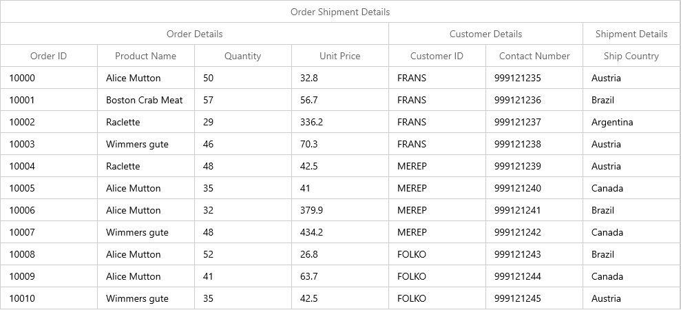
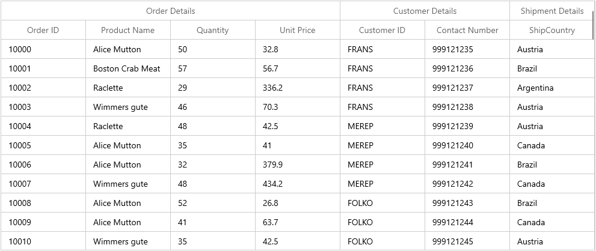
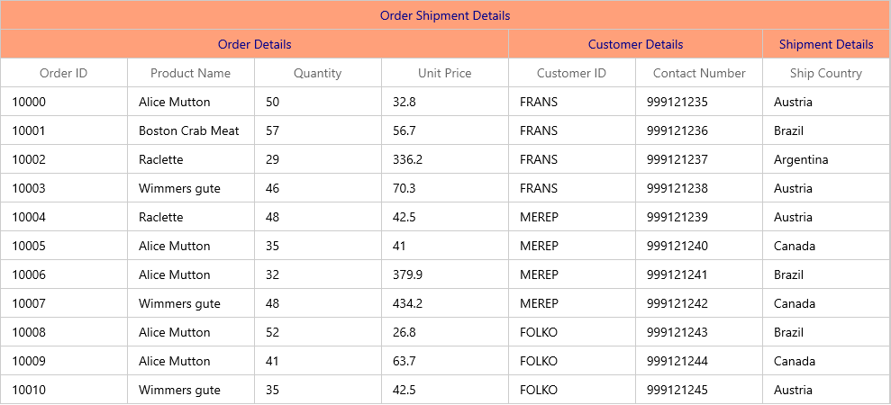

# How to create WinUI DataGrid (SfDataGrid) with multiple header rows (Stacked Header Rows)?

# About the sample

This example illustrates how to create SfDataGrid with multiple header rows using StackedHeaderRows.

[WinUI DataGrid](https://www.syncfusion.com/winui-controls/datagrid) (SfDataGrid) supports to add additional unbound header rows using [StackedHeaderRows](https://help.syncfusion.com/cr/winui/Syncfusion.UI.Xaml.Grids.SfGridBase.html#Syncfusion_UI_Xaml_Grids_SfGridBase_StackedHeaderRows). This can be used to add multiple header rows for the SfDataGrid and to group one or more columns under each stacked header.
Each [StackedHeaderRow](https://help.syncfusion.com/cr/winui/Syncfusion.UI.Xaml.Grids.StackedHeaderRow.html) contains [StackedColumns](https://help.syncfusion.com/cr/winui/Syncfusion.UI.Xaml.Grids.StackedColumns.html) where each [StackedColumn](https://help.syncfusion.com/cr/winui/Syncfusion.UI.Xaml.Grids.StackedColumn.html) contains a number of child columns. You can set the text displayed in the stacked column by using `StackedColumn.HeaderText` property.

```Xaml
<syncfusion:SfDataGrid x:Name="dataGrid"
                       ColumnWidthMode="Star"
                       Margin="10"
                       ItemsSource="{Binding OrdersListDetails}">
    <syncfusion:SfDataGrid.DataContext>
        <local:ViewModel />
    </syncfusion:SfDataGrid.DataContext>
    <syncfusion:SfDataGrid.StackedHeaderRows>
        <grid:StackedHeaderRow>
            <grid:StackedHeaderRow.StackedColumns>
                <grid:StackedColumn ChildColumns="OrderID,CustomerID,ProductName,Quantity,UnitPrice,ContactNumber,ShipCountry" 
                                    HeaderText="Order Shipment Details" />
            </grid:StackedHeaderRow.StackedColumns>
        </grid:StackedHeaderRow>
        <grid:StackedHeaderRow>
            <grid:StackedHeaderRow.StackedColumns>
                <grid:StackedColumn ChildColumns="OrderID,ProductName,Quantity,UnitPrice" HeaderText="Order Details" />
                <grid:StackedColumn ChildColumns="CustomerID,ContactNumber" HeaderText="Customer Details" />
                <grid:StackedColumn ChildColumns="ShipCountry" HeaderText="Shipment Details " />
            </grid:StackedHeaderRow.StackedColumns>
        </grid:StackedHeaderRow>
    </syncfusion:SfDataGrid.StackedHeaderRows>
</syncfusion:SfDataGrid>
```



## Stacked Headers using Data Annotation

It is possible to add the stacked headers using `GroupName` property of [Data Annotations Display attributes](https://docs.microsoft.com/en-us/dotnet/api/system.componentmodel.dataannotations.displayattribute?view=net-5.0).

```C#

/// <summary>
/// Gets or sets the order ID.
/// </summary>
/// <value>The order ID.</value>
[Display(GroupName = "Order Details", Name = "Order ID")]
public int OrderID
{
    get
    {
        return this._OrderID;
    }
    set
    {
        this._OrderID = value;
        this.OnPropertyChanged("OrderID");
    }
}


/// <summary>
/// Gets or sets the Product.
/// </summary>
/// <value>The Product.</value>
[Display(GroupName = "Order Details", Name = "Product Name")]
public string ProductName
{
    get
    {
        return this._product;
    }
    set
    {
        this._product = value;
        this.OnPropertyChanged("ProductName");
    }
}

/// <summary>
/// Gets or sets quantity
/// </summary>
/// <value>the quantity</value>     
[Display(GroupName = "Order Details", Name = "Quantity")]
public int Quantity
{
    get
    {
        return this._Quantity;
    }
    set
    {
        _Quantity = value;
        OnPropertyChanged("Quantity");
    }
}

/// <summary>
/// Gets or sets the unit price.
/// </summary>
/// <value>The unit price.</value>
[Display(GroupName = "Order Details", Name = "Unit Price")]
[DataType(DataType.Currency)]
public double UnitPrice
{
    get
    {
        return _unitPrice;
    }
    set
    {
        _unitPrice = value;
        OnPropertyChanged("UnitPrice");
    }
}

/// <summary>
/// Gets or sets the customer ID.
/// </summary>
/// <value>The customer ID.</value>
[Display(GroupName = "Customer Details", Name = "Customer ID")]
public string CustomerID
{
    get
    {
        return this._CustomerID;
    }
    set
    {
        this._CustomerID = value;
        this.OnPropertyChanged("CustomerID");
    }
}

/// <summary>
/// Gets or sets quantity
/// </summary>
/// <value>the quantity</value>     
[Display(GroupName = "Customer Details", Name = "Contact Number")]
public int ContactNumber
{
    get
    {
        return this._contactNumber;
    }
    set
    {
        _contactNumber = value;
        OnPropertyChanged("ContactNumber");
    }
}

/// <summary>
/// Gets or sets the ShipAddress.
/// </summary>
/// <value>The ShipAddress.</value>
[Display(GroupName = "Shipment Details", Name = "ShipCountry")]
public string ShipCountry
{
    get
    {
        return this._shipaddress;
    }
    set
    {
        this._shipaddress = value;
        this.OnPropertyChanged("ShipCountry");

    }
}

```



## Changing stacked header row height

You can change the height of stacked header rows by using [SfDataGrid.QueryRowHeight](https://help.syncfusion.com/cr/winui/Syncfusion.UI.Xaml.DataGrid.SfDataGrid.html#Syncfusion_UI_Xaml_DataGrid_SfDataGrid_QueryRowHeight) event.

```C#
using Syncfusion.UI.Xaml.DataGrid;

this.dataGrid.QueryRowHeight += DataGrid_QueryRowHeight;

private void DataGrid_QueryRowHeight(object sender, Syncfusion.UI.Xaml.DataGrid.QueryRowHeightEventArgs e)
{
    if (e.RowIndex < this.dataGrid.GetHeaderIndex())
    {
        e.Height = 50;
        e.Handled = true;
    }
}
```

## Styling Stacked Headers

The appearance of stacked header can be customized by using the keys `SyncfusionGridStackedHeaderCellControlBackground` and `SyncfusionGridStackedHeaderCellControlForeground`.

```Xaml
<Grid>
    <Grid.Resources>
        <SolidColorBrush x:Key="SyncfusionGridStackedHeaderCellControlBackground" Color="LightSalmon"/>
        <SolidColorBrush x:Key="SyncfusionGridStackedHeaderCellControlForeground" Color="DarkBlue"/>
    </Grid.Resources>
    <syncfusion:SfDataGrid x:Name="dataGrid"
                           ColumnWidthMode="Star"
                           Margin="10"
                           ItemsSource="{Binding OrdersListDetails}">
        <syncfusion:SfDataGrid.DataContext>
            <local:ViewModel />
        </syncfusion:SfDataGrid.DataContext>
        <syncfusion:SfDataGrid.StackedHeaderRows>
            <grid:StackedHeaderRow>
                <grid:StackedHeaderRow.StackedColumns>
                    <grid:StackedColumn ChildColumns="OrderID,CustomerID,ProductName,Quantity,UnitPrice,ContactNumber,ShipCountry" 
                                        HeaderText="Order Shipment Details" />
                </grid:StackedHeaderRow.StackedColumns>
            </grid:StackedHeaderRow>
            <grid:StackedHeaderRow>
                <grid:StackedHeaderRow.StackedColumns>
                    <grid:StackedColumn ChildColumns="OrderID,ProductName,Quantity,UnitPrice" HeaderText="Order Details" />
                    <grid:StackedColumn ChildColumns="CustomerID,ContactNumber" HeaderText="Customer Details" />
                    <grid:StackedColumn ChildColumns="ShipCountry" HeaderText="Shipment Details " />
                </grid:StackedHeaderRow.StackedColumns>
            </grid:StackedHeaderRow>
        </syncfusion:SfDataGrid.StackedHeaderRows>
    </syncfusion:SfDataGrid>

```




Take a moment to peruse the [WinUI DataGrid – Stacked Header Row](https://help.syncfusion.com/winui/datagrid/stacked-headers) documentation, where you can find about stacked header rows with code examples.

## Requirements to run the demo

Visual Studio 2015 and above versions.
